<p align="center">
  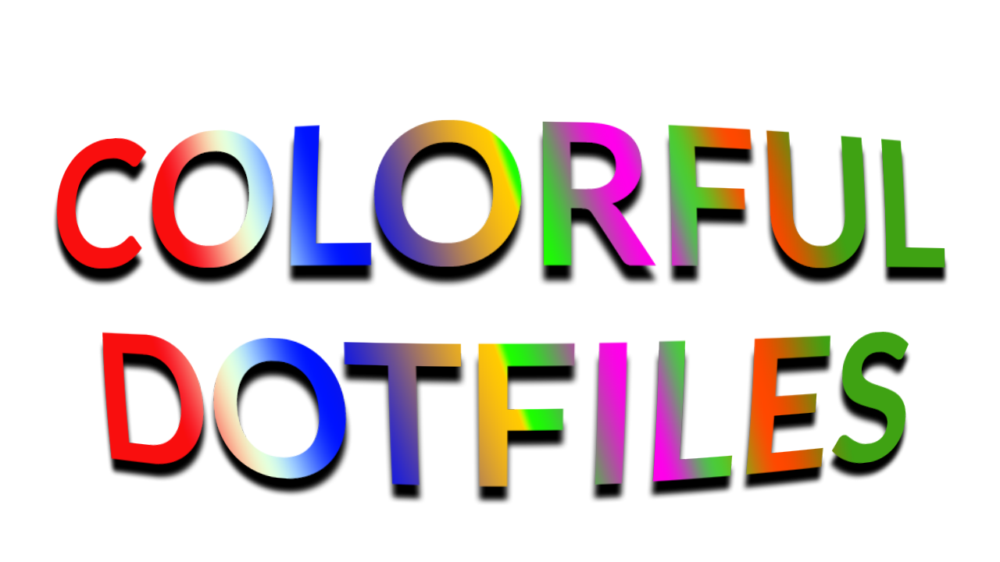
</p>

# Table of Contents

* [Introduction](#Introduction)
* [Overview](#Overview)
* [Installation](#Installation)
* [Anime Wallpapers](#Anime-Wallpapers)
* [Virtualization](#Virtualization)
* [Configuration Files](#Configuration-Files)
* [BSPWM Mouse](#BSPWM-Mouse)
* [Keyboard Shortcuts](#Keyboard-Shortcuts)
* [Theme](#Theme)
* [Neovim](#Neovim)

# Introduction

A truly colorful linux configuration.

This is my personal collection of configuration files, feel free to use it but don't forget to give me **credits** :). 

The [installation section](#installation) will guide you through a step-by-step installation process.

**Don't forget to give me a ⭐ to motivate me to continue adding cool features to this configuration**.

Here are some details about my setup:

- **WM**: [bspwm](https://github.com/baskerville/bspwm)
- **Hotkey**: [sxhkd](https://github.com/baskerville/sxhkd)
- **Locker**: [i3lock-fancy](https://github.com/meskarune/i3lock-fancy)
- **Menu**: [jgmenu](https://github.com/johanmalm/jgmenu)
- **Notifications**: [dunst](https://github.com/dunst-project/dunst)
- **Shell**: [zsh](https://www.zsh.org/)
- **Editor**: [neovim](https://neovim.io/)
- **Bars**: [polybar](https://github.com/polybar/polybar)
- **Compositor**: [picom (yshui)](https://github.com/yshui/picom)
- **File Manager**: [thunar](https://docs.xfce.org/xfce/thunar/start)
- **Font Terminal**: [iosevka](https://github.com/ryanoasis/nerd-fonts/tree/master/patched-fonts/Iosevka)
- **Application Launcher**: [rofi](https://github.com/davatorium/rofi)
- **Browsers**: [firefox](https://www.mozilla.org/en-US/firefox/new/)
- **Terminals**: [kitty](https://sw.kovidgoyal.net/kitty/) (for aesthetics) and [qterminal](https://github.com/lxqt/qterminal) (for pen-testing)
- **Static Wallpaper**: [feh](https://github.com/derf/feh)
- **Live Wallpaper**: [gpu-video-wallpaper](https://github.com/nozerobit/gpu-video-wallpaper)

All the features can be seen in the [overview](#overview) section.

---

Static wallpapers site:

- [hdqwalls](https://hdqwalls.com/)

Animated wallpapers site:

- [desktophut](https://www.desktophut.com/)

# Overview

**Note: This section contains highly compressed / low-quality GIFs, in reality is not blurry and grainy.**

There are multiple polybars:

<p align="center">
  
</p>

Each polybar theme has a custom launcher:

<p align="center">
  
</p>

Normally you would use `Windows + Alt + R` to reload bspwm in order to fix the wallpaper resolution scale and the polybar when changing screen resolution but I have made a ~~script~~ with xeventbind and a polybar configuration so that you don't have to reload bspwm. In other words, it automatically changes the wallpaper and the polybar resolution/size when changing the screen resolution **without** the need to reload bspwm:

<p align="center">
  
</p>

These are the available polybars:

<p align="center">
  
</p>

> Note: The color of these bars is dynamic and the colors change according to the wallpaper.

Transparent theme created by [@nozerobit](https://github.com/nozerobit) (me):

<p align="center">
  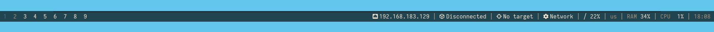
</p>

Colorblocks theme (default), theme created by [@adi1090x](https://github.com/adi1090x/polybar-themes) and heavily modified by [@nozerobit](https://github.com/nozerobit) (me):

<p align="center">
  
</p>

Forest theme (no pywal), theme created by [@adi1090x](https://github.com/adi1090x/polybar-themes) and modified by [@nozerobit](https://github.com/nozerobit) (me):

<p align="center">
  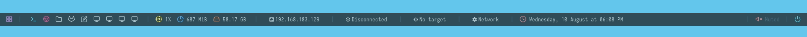
</p>

Shapes theme, theme created by [@adi1090x](https://github.com/adi1090x/polybar-themes) and modified by [@nozerobit](https://github.com/nozerobit) (me):

<p align="center">
  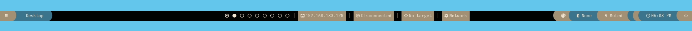
</p>

Docky theme, theme created by [@adi1090x](https://github.com/adi1090x/polybar-themes) and modified by [@nozerobit](https://github.com/nozerobit) (me):

<p align="center">
  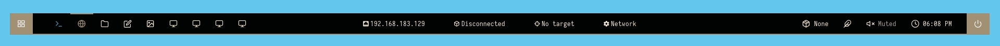
</p>

Grayblocks theme, theme created by [@adi1090x](https://github.com/adi1090x/polybar-themes) and modified by [@nozerobit](https://github.com/nozerobit) (me):

<p align="center">
  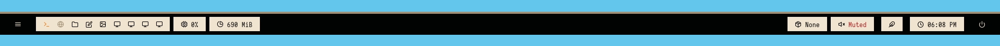
</p>

Material theme, theme created by [@adi1090x](https://github.com/adi1090x/polybar-themes) and modified by [@nozerobit](https://github.com/nozerobit) (me):

<p align="center">
  
</p>

Hack top bar theme, theme created by [@adi1090x](https://github.com/adi1090x/polybar-themes) and modified by [@nozerobit](https://github.com/nozerobit) (me):

<p align="center">
  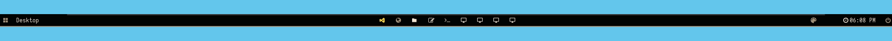
</p>

Hack bottom bar theme, theme created by [@adi1090x](https://github.com/adi1090x/polybar-themes) and modified by [@nozerobit](https://github.com/nozerobit) (me):

<p align="center">
  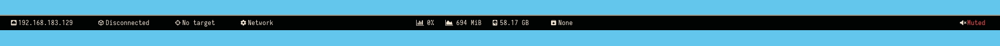
</p>

Some polybars themes have audio volume modules. The volume can be adjusted with the mouse wheel.

You can change the polybar theme with the launcher:

```sh
❯ change-polybar
Usage: change-polybar --theme

Available Themes:
--colorblocks   --docky		   --hack  
--forest        --grayblocks   --trans  
--shapes	--material
```

Here is an example:

```sh
change-polybar --hack
```

Some polybars are slower to load than others so it is recommended to kill the polybar first:

```sh
killall polybar; change-polybar --material
```

If you want to change the default polybar simply edit the BSPWM configuration file:

```sh
vim ~/.config/bspwm/bspwmrc
```

Replace the following line:

```sh
~/.config/polybar/launch.sh --colorblocks &
```

You can use `Windows + Alt + W` to shuffle wallpapers and change colors on the fly:

<p align="center">
  
</p>

> Note: In the weird case that the polybar dies, you can use `Windows + Alt + R` to restart BSPWM.
> Some polybars themes do take more time to load since they use more scripts and icons.
> The polybar `hack` theme is the slowest.
> The polybar `forest` theme is not supported.

> Important: Avoid spamming this keyboard shortcut.

Alternatively, you could use `Windows + Alt + E` to change to a specific wallpaper using the GUI:

<p align="center">
  
</p>

Alternatively, you can use `Windows + Alt + X` to select the wallpaper with a preview, then hit `Ctrl + x` and then `W` to change the wallpaper. Once the wallpaper is set we can close the program with `Windows + W`:

<p align="center">
  
</p>

We can also use **live wallpaper / animated wallpapers** with `vwallpaper` (demo script):

```shell
vwallpaper --start ~/Videos/wallpapers-animated/Cyberpunk-2077-City-Live-Wallpaper.mp4 &>/dev/null & disown
```

<p align="center">
  
</p>

We can stop the **live wallpaper / animated wallpapers** with the following:

```shell
vwallpaper --stop
```

---

**Important**: If the wallpaper doesn't have the correct resolution, you can change it by editing:

```sh
sudo vim $(which video-wallpaper.sh)
```

Then change the resolution at line 60:

```sh
   # Change -g <TO_YOUR_RESOLUTION>
	"$scriptdir"/xwinwrap -g 3840x2160 -fdt -ni -b -nf -un -o 1.0 -- mpv -wid WID --loop --no-audio "$VIDEO_PATH" & disown
```

I'll try to find a better solution but for now that should do the work.

**Important**: Transparency should work by default in native installs as long as you have the GPU drivers installed in your system. In most virtual machines that are using virtualized GPUs you will have to set X11 as the video output. If your virtualization software supports GPU passthrough then you may not have to change anything, unless you want to select a specific video output driver.

If you want to add transparency to a VM add the following flags:

```sh
-vo x11 --hwdec=auto-safe --profile=sw-fast
```

> Note: This may increase the CPU usage up to 15%-25% in VMs. 

If you don't care about the performance then you can follow this example:

```sh
xwinwrap -g 1920x1080 -fdt -ni -b -nf -un -o 1.0 -- mpv -wid WID -vo x11 --hwdec=auto-safe --profile=sw-fast --loop --no-audio ~/Videos/wallpapers-animated/Astronaut-In-Space-With-Jellyfish-Live-Wallpaper.mp4
```

You can use **htop** to monitor the performance of each process:

```sh
htop
```

You will probably see that the Xorg process increases up to 60%-70% when the video output (-vo) is set to `x11` in `mpv`. Therefore, I don't recommend running this "video output driver".

For more information about video output drivers read the mpv repo [vo.rst](https://github.com/mpv-player/mpv/blob/master/DOCS/man/vo.rst).

---

The animated wallpapers also support automatic resizing:

<p align="center">
  
</p>

We can close an animated wallpaper with the following command:

```shell
video-wallpaper.sh --stop
```

You could also use `Windows + Alt + W` or `Windows + Alt + E` to change the wallpaper.

The terminal font size can be changed with `Windows + Alt + F`:

<p align="center">
  
</p>

> Note: When using `qterminal` is recommended to use the GUI preferences window instead. Also, you need to open a new terminal to see the changes.

You can change the **corners** of the windows and the polybar to **rounded or sharp** corners with the shorcut `Windows + Alt + B`.

<p align="center">
  
</p>

You can also **copy IPs** to the clipboard with a **left click** on the bar (ethernet, vpn or target):

<p align="center">
  
</p>

> Note: There's a VPN status bar, it shows your VPN IP when connected and it tells you when you're disconnected from a VPN.

There's a network bar where you can configure your network:

<p align="center">
  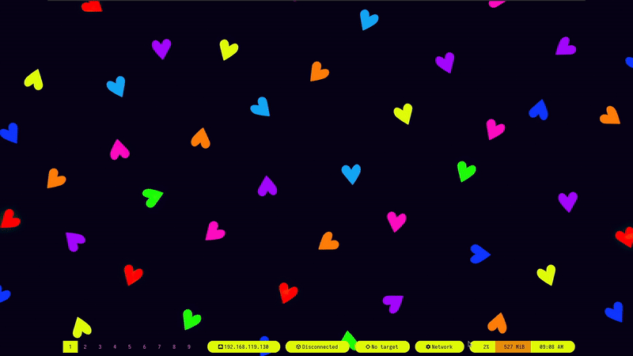
</p>

On zsh you can set the target IP with the command `setarget 10.10.10.10`. You can use the command `notarget` to remove the target IP:

<p align="center">
  
</p>

You can set a **default wallpaper** that will be used at startup with the following:

```sh
❯ default-wallpaper --set ~/Pictures/Wallpapers/i-love-8-bit-qhd-1920x1080.jpg
[+] Added a default wallpaper!
❯ default-wallpaper --remove
[+] Random wallpapers will be set at startup!
```

Some polybars themes are slower to load than others so it is recommended to kill the polybar first:

```sh
killall polybar; default-wallpaper --set ~/Pictures/Wallpapers/i-love-8-bit-qhd-1920x1080.jpg
```

You can also customize the polybar theme colorblocks:

<p align="center">
  
</p>

This is the command for the `polybar-changer` help menu:

```sh
polybar-changer --help
```

You can use `Windows + Q` to open the power menu:

<p align="center">
  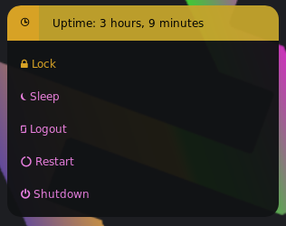
</p>

You can escape or exit the powermenu with the `Escape/Esc` key in your keyboard.

> If you put the computer to sleep, you can wake it up with the `Escape/Esc` key on your keyboard.

You can also see a preview of each workspace, this is very useful when we want to know which applications or windows are open in each workspace.

<p align="center">
  
</p>

Activate the bspwm workspace preview with the keyboard shortcut `Ctrl + Alt + P`, then view the workspaces preview with the `Windows` key. Then it takes a screenshot of each workspace when you navigate or change the workspace.

Once you're done, you can close the process with `Ctrl + Alt + D` or `Ctrl + Alt + P`.

> Use `Ctrl + Alt + P` to completely de/activate bspwm workspace preview.
> Use `Ctrl + Alt + D` to deactivate bspwm workspace preview for the current screen resolution but automatically activate it again when the screen resolution changes.

Create pentesting project directories with `mk`:

```zsh
mk
```

View the storage (sda) information:

```zsh
drive
```

View your system information:

```zsh
info
```

Alternatively, you can use `neofetch` to view your system information:

```sh
neofetch
```

Kill a process:

```
kp nvim
```

Extract nmap ports:

```zsh
xp filename.gnmap
```

Identify the operating system:

```zsh
os 127.0.0.1
```

You can print the keyboard shortcuts with the script:

```sh
shortcuts

Usage: shortcuts [--sxhkd] [--kitty] [--neovim]
--sxhkd: Print sxhkd shortcuts.
--kitty: Print kitty shortcuts.
--neovim: Print neovim shortcuts.
--help: Print this help menu.

Info: Arrows = Left,Up,Down,Right keys
```

You can enable or disable picom shadows with `pshadow`:

```sh
pshadow

Usage: pshadow [--enable] [--disable]
--enable: Enable picom shadow.
--disable: Disable picom shadow.
--help: Print this help menu.
```

# APT Tool

In the case that you're in a "bloated" system, you can use the `apt-uninstaller` tool:

```sh
❯ apt-uninstaller.sh
	APT Uninstaller by nozerobit

[i] This script uninstalls APT packages
[i] You can search and select multiple packages
[i] Keyboard Shortcut: Use Tab to select multiple packages
[i] Keyboard Shortcut: Use Ctrl+C to exit
```

# Installation

It is recommended to disable sleep because the script can take a while to finish:

<div style="text-align:center"></div>

These are the installation steps:

1. Clone this repo and change the directory:

```bash
git clone https://github.com/nozerobit/colorful-dotfiles.git && cd colorful-dotfiles
```

Then use the correct installation script and make sure you use one of the compatible desktop environments when running the installation script:

<center>
<table class="tg">
<thead>
  <tr>
    <th class="tg-i91a">Operating Systems Tested</th>
    <th class="tg-i91a">Installation Script</th>
    <th class="tg-0lax">Compatible Desktop Environments (Important)</th>
  </tr>
</thead>
<tbody>
  <tr>
    <td class="tg-btxf">Kali Linux</td>
    <td class="tg-btxf">install.sh, install_clear.sh</td>
    <td class="tg-buh4">Xfce (recommended), Mate</td>
  </tr>
  <tr>
    <td class="tg-0pky">ParrotOS</td>
    <td class="tg-0pky">install.sh, install_clear.sh</td>
    <td class="tg-0lax">Xfce (recommended), Mate</td>
  </tr>
  <tr>
    <td class="tg-btxf">Ubuntu</td>
    <td class="tg-btxf">install.sh, install_clear.sh</td>
    <td class="tg-buh4">Xfce (recommended), Mate</td>
  </tr>
  <tr>
    <td class="tg-0pky">Pop!_OS</td>
    <td class="tg-0pky">install.sh, install_clear.sh</td>
    <td class="tg-0lax">Xfce (recommended), Mate</td>
  </tr>
  <tr>
    <td class="tg-btxf">Debian</td>
    <td class="tg-btxf">install.sh, install_clear.sh</td>
    <td class="tg-buh4">Xfce (recommended), Mate</td>
  </tr>
  <tr>
    <td class="tg-0pky">Arch Linux</td>
    <td class="tg-0pky">arch_install.sh</td>
    <td class="tg-0lax">Xfce (recommended), Mate</td>
  </tr>
</tbody>
</table>
</center>

> **Note**: The installation scripts may work on other Debian-based or Arch-based distributions.

> **Tip**: If the desktop environment is not in the table above then it is recommended to install a compatible desktop environment and log in using that particular desktop environment that you decided to install. I recommend Xfce as it is the one that is tested the most.

> **Important**: Don't run this script as the `root` user. Run it with a user that's in the `sudo/wheel` group.

> **Please don't install this script while using GNOME. For some reason `pywal` doesn't change the wallpaper when using GNOME. Here is a [temporary solution](#Pywal-GNOME).**

2. Run the installation script from the `colorful-dotfiles` directory:

```bash
chmod +x install_clear.sh && ./install_clear.sh
```

You can use one of these scripts:

- install.sh: Hides the output and stores it in a log.
- install_clear.sh (Recommended): Doesn't hide any output. This is better for troubleshooting.

> **Note**: Distribution updates and upgrades do sometimes change the dependencies and also other installations steps do change over time so it is a challenge to consistently maintain this installation script compatible for multiple distributions.

> **Solution**: If you find an issue, you may need to modify the installation script.

If you're installing this in Arch Linux:

```bash
chmod +x arch_install.sh && ./arch_install.sh
```

You can monitor the installation with the following command (optional):

```sh
watch -n 1 tail /home/kali/colorful-dotfiles/install_log.txt
```

The script has four (4) symbols:

1. `[+]` = Success
2. `[-]` = Failed
3. `[!]` = Information
4. `[i]` = Information to solve the error

The installation can take a while because it downloads a lot of things. The time that it takes to finish will depend mostly on your internet download bandwidth provided by your ISP.

A log is also created for troubleshooting purposes.

3. Reboot the machine (required):

```bash
reboot || systemctl reboot
```

Once you have rebooted the machine, select bspwm as the window manager and then log in. 

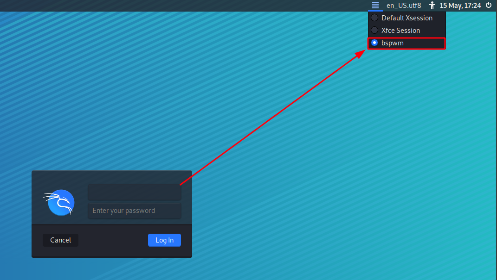

You can restart bspwm at any time with `Windows + Alt + R`, this is useful to fix a WM issue.

That's it, now hit two (2) times the following keyboard shorcuts: 

- `Windows + Alt + W` and `Windows + Alt + B` and see which look you like the most. 

> Note: You may need to hit those keyboard shortcuts multiple times when you first install this configuration.

It is recommended to verify the [Neovim](#Neovim) plugins.

# Pywal GNOME

If you installed this configuration with a system that uses GNOME you might have an issue with pywal. It can "fixed" with the following:

```sh
pywal_get() {
	wal -i "$1" -q -t; feh --bg-scale "$(< "${HOME}/.cache/wal/wal")"
}
```

Edit each pywal script on the following path:

```sh
.config/polybar/theme_name/scripts/pywal.sh
.config/polybar/colorblocks/scripts/pywal.sh
```

# Anime Wallpapers

If you want to add `anime wallpapers` you can do the following:

```sh
cp wallpapers-anime/* ~/Pictures/Wallpapers/
```

If you want to add it to the root user:

```sh
sudo cp wallpapers-anime/* /root/Pictures/Wallpapers
```

# Virtualization

If you are in a virtual machine and you want to enable drag-and-drop files and copy-paste then read this section.

## VMware Guest Tools

In Kali Linux the VMware guest tools are already configured so you don't have to do anything.

If you're using another Debian distro then install the following packages:

```sh
sudo apt install open-vm-tools open-vm-tools-desktop
```

If you're using Arch in VMware, [read this documentation](https://wiki.archlinux.org/title/VMware/Install_Arch_Linux_as_a_guest).


## VirtualBox Guest Tools

Install VirtualBox guest tools:

```
sudo apt install -y virtualbox-guest-x11
```

Start the service:

```
sudo systemctl status virtualbox-guest-utils.service
```

Enable VirtualBox service at startup:

```
sudo systemctl enable virtualbox-guest-utils.service
```

## QEMU Guest Tools

The SPICE agent allows for automatic X session resolution adjustment to the client resolution. The SPICE agent also provides support for copy and pasting between the host and guest and prevents mouse cursor lag.

```sh
sudo apt install -y spice-vdagent
```

Start the service:

```sh
sudo systemctl start spice-vdagent
```

The QEMU guest agent runs inside the guest and allows the host machine to issue commands to the guest operating system using libvirt, helping with functions such as freezing and thawing filesystems. The guest operating system then responds to those commands asynchronously. 

```sh
sudo apt install -y qemu-guest-agent
```

Start the service:

```sh
sudo systemctl start qemu-guest-agent
```

If you want to add this service at startup, add it to `bspwmrc`:

```sh
echo "systemctl start qemu-guest-agent" >> ~/.config/bspwm/bspwmrc
```

Since the service.unit file is not pre-configured for startups as seen here:

```sh
❯ sudo systemctl enable qemu-guest-agent

Synchronizing state of qemu-guest-agent.service with SysV service script with /lib/systemd/systemd-sysv-install.
Executing: /lib/systemd/systemd-sysv-install enable qemu-guest-agent
The unit files have no installation config (WantedBy=, RequiredBy=, Also=,
Alias= settings in the [Install] section, and DefaultInstance= for template
units). This means they are not meant to be enabled using systemctl.
 
Possible reasons for having this kind of units are:
• A unit may be statically enabled by being symlinked from another unit's
  .wants/ or .requires/ directory.
• A unit's purpose may be to act as a helper for some other unit which has
  a requirement dependency on it.
• A unit may be started when needed via activation (socket, path, timer,
  D-Bus, udev, scripted systemctl call, ...).
• In case of template units, the unit is meant to be enabled with some
  instance name specified.
```

You could create your own service file though.

More information [here](https://access.redhat.com/documentation/en-us/red_hat_enterprise_linux/7/html/virtualization_deployment_and_administration_guide/chap-qemu_guest_agent).

## Hyper-V Enhanced Session

Enable `Hyper-V Enhanced Session` in Hyper-V Settings:

<p align="center">
  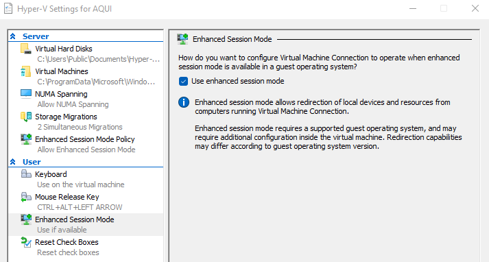
</p>

Enable `Guest services` in Hyper-V VM Settings:

<p align="center">
  
</p>

Lastly, read the official [Kali Linux documentation](https://www.kali.org/docs/virtualization/install-hyper-v-guest-enhanced-session-mode/) and follow the steps.

# Configuration Files

If you would like to change some settings, here are the locations of the configuration files.

`alacritty` Terminal Configuration:

```shell
~/.config/alacritty/alacritty.yml
```

`kitty` Terminal Configuration:

```shell
~/.config/kitty/kitty.conf
```

`bspwm` WM Configuration:

```shell
~/.config/bspwm/bspwmrc
```

`sxhkd` Keyboard Shortcuts Configuration:

```shell
~/.config/sxhkd/sxhkdrc
```

`picom` Transparency Configuration:

```shell
~/.config/picom/picom.conf
```

> Note: If you have issues with picom features, go to the [yshui repo](https://github.com/yshui/picom) and view the [issues](https://github.com/yshui/picom/issues).

`nvim` Terminal Text Editor Configuration:

```shell
~/.config/nvim/init.vim
```

`polybar` Workspace and Desktop Panel Configuration:

```shell
~/.config/polybar/colorblocks/launch.sh
```

`rofi` Program Launcher Configuration:

```shell
~/.config/rofi/config
```

`zsh` Shell Configuration:

```shell
~/.zshrc
```

## BSPWM Mouse Keyboard Shortcuts

| Action                                         | Shortcut                |
|------------------------------------------------|-------------------------|
| Move a floating window or swap a tiled window. | `alt+left mouse click`  |
| Resize any tiling or floating window.          | `alt+right mouse click` |
| Open jgmenu for context menu.                  | `super+right mouse click` |


## Keyboard Shortcuts

Since some keyboards don't have the arrow keys; the `HJKL` keys are used instead.
Also since some keyboards don't have the right `windows` key; the `alt` key is used instead because the `alt` key is almost always on the left side and right side of a keyboard.

| Action                                                                          | Shortcut                                                               |
|---------------------------------------------------------------------------------|------------------------------------------------------------------------|
| Open the terminal emulator (kitty).                                             | `windows+enter`                                                        |
| Open the terminal-emulator (qterminal), doesn't apply the pywal color.          | `windows+ctrl+enter`                                                   |
| Launch the power menu.                                                          | `windows+q` or `alt+q`                                                 |
| Close the current window.                                                       | `windows+w` or `alt+w`                                                 |
| Restart the bspwm configuration.                                                | `windows+alt+r` or `ctrl+alt+r`                                        |
| Logout from the system.                                                         | `windows+alt+q` or `ctrl+alt+q`                                        |
| Move through the windows in the current workspace.                              | `windows+left,down,up,right` or `windows+h,j,k,l`                      | 
| Open rofi and Esc to exit.                                                      | `windows+d` or `alt+d`                                                 |
| Open rofi and run commands as sudo, useful for tools such as wireshark.         | `windows+ctrl+d`                                                       |
| Change the workspace.                                                           | `windows+1,2,3,4,5,6,7,8,9` or `alt+1,2,3,4,5,6,7,8,9`                 |
| Change the current window to tiling mode.                                       | `windows+t` or `alt+t`                                                 |
| Change the current window to "full" mode.                                       | `windows+m` or `alt+m`                                                 |
| Change the current window to full-screen mode                                   | `windows+f` or `alt+f`                                                 |
| Change the current window to floating mode.                                     | `windows+s` or `alt+s`                                                 |
| Move the current window to another workspace.                                   | `windows+shift+1,2,3,4,5,6,7,8,9` or `alt+shift+1,2,3,4,5,6,7,8,9`     |
| Resize current window (only works if you are in terminal or floating mode).     | `windows+alt+left,down,up,right` or `windows+alt+h,j,k,l`              |
| Change the position of the current window (only works in floating mode).        | `windows+ctrl+left,down,up,right` or `windows+ctrl+h,j,k,l`            |
| Show a preselection and then open a window.                                     | `windows+ctrl+alt+left,down,up,right` or `windows+ctrl+alt+h,j,k,l`    |
| Undo the preselection.                                                          | `windows+ctrl+space`                                                   |
| Close and kill.                                                                 | `windows+shift+w` or `alt+shift+w`                                     |
| Alternate between the tiled and monocle layout.                                 | `windows+m` or `alt+m`                                                 |
| Set the window state.                                                           | `windows+shift+t,s,f` or `alt+shift+t,s,f`                             |
| Set the node flags.                                                             | `windows+ctrl+m,x,y,z`                                                 |
| Focus on older or newer node in the focus history.                              | `windows+o,i`                                                          |
| Focus the last node/desktop.                                                    | `windows+grave,Tab` or `alt+grave,Tab`                                 |
| Focus the next/previous desktop in the current monitor.                         | `windows+bracket{left,right}` or `windows+bracket{h,l}`                |
| Focus the next/previous window in the current desktop.                          | `windows+shift+c`                                                      |
| Focus the node for the given path jump.                                         | `windows+p,b,comma,period`                                             |
| Focus the node in the given direction (swap window).                            | `windows+shift+left,down,up,right` or `windows+shift+h,j,k,l`          |

> Note: The HJKL navigation uses the format: left = h, down = j, up = k, right = l 

### Special Keyboard Shortcuts

| Action                                         | Shortcut                               |
|------------------------------------------------|----------------------------------------|
| Shuffle wallpapers on the fly		               | `windows+alt+w` or `ctrl+alt+w`        |
| Activate the bspwm workspace preview           | `ctrl+alt+p`            	              |
| Deactivate the bspwm workspace preview         | `ctrl+alt+d`                           |
| Show bspwm workspace preview (when activated)	 | `windows`				                      |
| Change to a specific wallpaper using the GUI.  | `windows+alt+e or ctrl+alt+e`          |
| Select wallpaper with a preview                | `windows+alt+x or ctrl+alt+x`          |
| Change the terminal font size.                 | `windows+alt+f` or `ctrl+alt+f`        |
| Change the corners of the windows.             | `windows+alt+b` or `ctrl+alt+b`        |
| Execute the lock screen.                       | `alt+shift+x`                          |
| Take a screenshot with flameshot.              | `print`                                |

> BSPWM Workpace Preview Functions: 
> Use `ctrl+alt+p` to completely de/activate bspwm workspace preview.
> Use `ctrl+alt+d` to deactive bspwm workspace preview for the current screen resolution but activate it again when the screen resolution changes.

# Kitty Sessions & Shorcuts

According to the [kitty documentation](https://sw.kovidgoyal.net/kitty/) we can define windows that can be tiled next to each other in arbitrary arrangements, based on [layouts](https://sw.kovidgoyal.net/kitty/overview/#layouts). Additionally, kitty also has the ability for window management, tabs management, layout management, and sessions. This means that kitty can be used as a replacement for tmux.

***Why use tmux?***

Tmux is used for `qterminal` since as of this date it doesn't have these features that `kitty` does have.

Although it could also be used in kitty; it is not recommended as seen [here](https://github.com/kovidgoyal/kitty/issues/391#issuecomment-638320745).

## Kitty Sessions

The [kitty command line interface](https://sw.kovidgoyal.net/kitty/invocation/?highlight=session#the-kitty-command-line-interface) provides an option to create sessions.

A session allows you to create one or more customized tabs on startup.

We can create a session with the following example:

```sh
kitty --session startup.conf
```

We can find more [information here](https://sw.kovidgoyal.net/kitty/overview/#startup-sessions).

## Kitty Window Management Shortcuts

Default keyboard shortcuts:

| Action                	| Shortcut                                                                                               	|
|-----------------------	|--------------------------------------------------------------------------------------------------------	|
| New window            	| `ctrl+shift+enter`                                                                   	                  |
| New OS window         	| `ctrl+shift+n`                                                                       	                  |
| Close window          	| `ctrl+shift+w`                                                                     	                    |
| Next window           	| `ctrl+shift+]`                                                                                         	|
| Previous window       	| `ctrl+shift+[`                                                                                         	|
| Move window forward   	| `ctrl+shift+f`                                                                                         	|
| Move window backward  	| `ctrl+shift+b`                                                                                         	|
| Move window to top    	| `ctrl+shift+`\`                                                                                        	|
| Visually focus window 	| `ctrl+shift+f7`                                                                                        	|
| Visually swap window  	| `ctrl+shift+f8`                                                                                        	|
| Focus specific window 	| `ctrl+shift+1, ctrl+shift+2 … ctrl+shift+0` (clockwise from the top-left)	                              |

## Kitty Tab Management Shortcuts

Default keyboard shortcuts:

| Action            	| Shortcut                                        	|
|-------------------	|-------------------------------------------------	|
| New tab           	| `ctrl+shift+t`               	                    |
| Close tab         	| `ctrl+shift+q`               	                    |
| Next tab          	| `ctrl+shift+right`	                              |
| Previous tab      	| `ctrl+shift+left`	                                |
| Next layout       	| `ctrl+shift+l`                                  	|
| Move tab forward  	| `ctrl+shift+.`                                  	|
| Move tab backward 	| `ctrl+shift+,`                                  	|
| Set tab title     	| `ctrl+shift+alt+t`         	                      |

## Kitty Layout Management Shortcuts

Default keyboard shortcuts:

| Action                                                                                                    	| Shortcut             	|
|-----------------------------------------------------------------------------------------------------------	|----------------------	|
| Next layout                                                                                               	| `ctrl+shift+up`      	|
| Go to layout (tall,stack, etc)                                                                            	| `ctrl+shift+down`    	|
| Previous layout                                                                                           	| `ctrl+shift+page_up` 	|
| Toggle layout (switches to the named layout or the previous layout) 	                                      | `ctrl+shift+page_down`|

## Kitty Scrolling Shortcuts

Default keyboard shortcuts:

| Action                    	| Shortcut             	|
|---------------------------	|----------------------	|
| Line up                   	| `ctrl+shift+up`      	|
| Line down                 	| `ctrl+shift+down`    	|
| Page up                   	| `ctrl+shift+page_up` 	|
| Page down                 	| `ctrl+shift+page_down`|
| Top                       	| `ctrl+shift+home`    	|
| Bottom                    	| `ctrl+shift+end`     	|
| Previous shell prompt     	| `ctrl+shift+z`       	|
| Next shell prompt         	| `ctrl+shift+x`       	|
| Browse scrollback in less 	| `ctrl+shift+h`       	|
| Browse last cmd output    	| `ctrl+shift+g`       	|

## Kitty Font Size Shortcuts

The [font size shortcuts](https://sw.kovidgoyal.net/kitty/conf/#font-sizes) are the default as well.

## Kitty Other Shortcuts

Other shortcuts can be [found here](https://sw.kovidgoyal.net/kitty/overview/?highlight=sessions#other-keyboard-shortcuts).

## Upgrade Kitty

You can upgrade kitty by following the [install documentation](https://sw.kovidgoyal.net/kitty/binary/).

# Notifications

Make sure that your previous desktop environment doesn't have a notifications daemon enabled such as `xfce4-notifyd` which will prevent dunst from acquiring `org.freedesktop.Notifications` through D-Bus. We can disable it by renaming the service:

```sh
sudo mv /usr/share/dbus-1/services/org.xfce.xfce4-notifyd.Notifications.service /usr/share/dbus-1/services/org.xfce.xfce4-notifyd.Notifications.service.disabled
```

# Compositor Blur

If you want to enable blur on the picom compositor, you can use this settings:

```sh
blur-method = "box";
blur-strength = 8;
blur-background = true;
backend = "xrender";
```

Alternatively, you can use `dual_kawase` with the `glx` backend:

```sh
blur-method = "dual_kawase";
blur-strength = 8;
blur-background = true;
backend = "glx";
```

> Note: This will affect the performance, especially in virtual machines.

Then run picom with `experimental-backends`:

```sh
picom --experimental-backends
```

> Note: You will need to edit the scripts and the bspwm configuration file `bspwmrc`.

# Terminal Emulator Performance Test

Install the required package:

```sh
sudo apt install tree
```

We can perform a performance test with the following command:

```sh
time tree /
```

> Note: I usually run the command above using my zsh configuration because I can see the time in seconds in the terminal prompt.

Then simply compare the results with another terminal emulator such as alacritty or qterminal.

> Note: The less time it takes to finish then the faster it is.

# Neovim

Run the commands below as your `user` and as the `root` user to correctly install/update the neovim plugins.

```bash
nvim
```

You can ignore this message because once the plugins are updated or installed it'll disappear:


1. Inside nvim, press the `:` (colon key) and type the following:

```shell
:PlugUpdate
```

**Reminder**: Repeat the same for root `sudo vim test`.

This is the output that you should see:


You can use Shift + R to retry. 

Once installed or updated, you can exit with `:q!`, and then type `vim` or `nvim` to check the health.

2. Check Health

```shell
:checkhealth
```

3. coc Intellisense

```shell
:CocInstall coc-json coc-tsserver coc-pyright coc-snippets coc-vimlsp
```

4. Search

```shell
:FZF
:Rg
:BLines
:Lines
```

***Do you want more coc extensions for nvim?***

Check out coc extensions here: https://github.com/neoclide/coc.nvim/wiki/Using-coc-extensions

***Do you want more themes for nvim?***

Check out this repo: https://github.com/rafi/awesome-vim-colorschemes 

***Do you want to configure coc.nvim?***

Check out this wiki: https://github.com/neoclide/coc.nvim/wiki/Using-the-configuration-file

## Upgrade Neovim

If you need to upgrade neovim, you can do it in the [releases page](https://github.com/neovim/neovim/releases/). Alternatively, you could build it from the source but it may not be stable.

## Neovim Shortcuts

These are the neovim shortcuts:

| Action            	| Shortcut                                                     	|
|-------------------	|--------------------------------------------------------------	|
| Resize windows    	| `alt+h,j,k,l` (Normal Mode)                                   |
| Escape            	| `jk` or `kj` (from Insert Mode to Normal Mode)               	|
| Save              	| `ctrl+s` (Normal Mode)                                       	|
| Quit              	| `ctrl+q` (Normal Mode)                                       	|
| Another Escape    	| `ctrl+c` (from Insert Mode to Normal Mode)                   	|
| Tabbing           	| `shift+left` or `shift+right` (Visual Mode) 	                |
| Tabs              	| `tab` or `shift+tab` (Insert Mode)                           	|
| Window Navigation 	| `ctrl+h,j,k,l` (Normal Mode)                                	|
| Text Navigation   	| `h,j,k,l` (Normal Mode)                                      	|

# Apps Setup for Debian Based Distros (Optional)

If you want to install some apps that I use then run this script:

```sh
chmod +x apps.sh && ./apps.sh
```

# References & Credits

**Progress Bar**:
- https://github.com/pollev/bash_progress_bar

**xeventbind**:
- https://github.com/ritave/xeventbind

**Configuration related software**:
- https://github.com/baskerville/bspwm
- https://github.com/baskerville/sxhkd
- https://github.com/jwilm/alacritty 
- https://github.com/kovidgoyal/kitty
- https://github.com/polybar/polybar
- https://github.com/adi1090x/polybar-themes
- https://github.com/davatorium/rofi
- https://github.com/ohmyzsh/ohmyzsh
- https://github.com/gpakosz/.tmux.git

**Fonts**:
- https://github.com/ryanoasis/nerd-fonts.git

**Neovim Plugins**:
- https://github.com/sheerun/vim-polyglot
- https://github.com/jiangmiao/auto-pairs
- https://github.com/joshdick/onedark.vim
- https://github.com/neoclide/coc.nvim
- https://github.com/vim-airline/vim-airline
- https://github.com/vim-airline/vim-airline-themes
- https://github.com/kevinhwang91/rnvimr
- https://github.com/liuchengxu/vim-which-key
- https://github.com/junegunn/fzf
- https://github.com/airblade/vim-rooter

